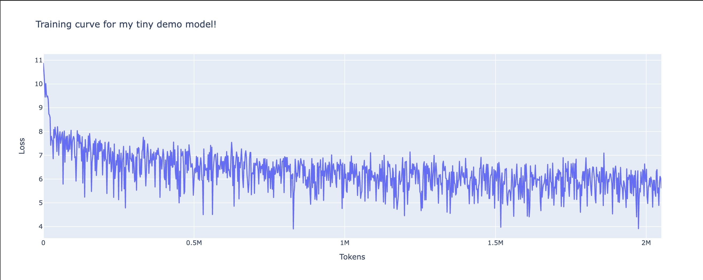

# GPT-2 From Scratch

A first-principles implementation of a GPT-2 style transformer in PyTorch, built by following
[Neel Nanda's "Implementing GPT-2 from scratch" tutorial](https://neelnanda.io/transformer-tutorial-2).
Every component — embeddings, LayerNorm, multi-head causal attention, MLP, and the unembedding —
is implemented by hand, then assembled into a working model and trained on real data.

## Training Curve

I trained a tiny demo model from scratch on the [Pile-10k](https://huggingface.co/datasets/NeelNanda/pile-10k)
dataset. Here's the loss coming down over ~2M tokens:

Loss drops sharply from ~11 (random init, ≈ `ln(50257)`) to the 5–6 range within the first
few hundred thousand tokens, then continues a steady noisy decline — exactly the shape you want
to see from a transformer that's actually learning.

## Model Config

The trained demo model is a small 2-layer transformer:

| Hyperparameter | Value |
| --- | --- |
| `n_layers` | 2 |
| `d_model` | 256 |
| `n_heads` | 4 |
| `d_head` | 64 |
| `d_mlp` | 1024 |
| `n_ctx` | 256 |
| `d_vocab` | 50257 (GPT-2 tokenizer) |

## Training Setup

| Setting | Value |
| --- | --- |
| Dataset | `NeelNanda/pile-10k` |
| Optimizer | AdamW |
| Learning rate | 1e-3 |
| Weight decay | 1e-2 |
| Batch size | 8 |
| Max steps | 1000 |
| Epochs | 1 |

The full architecture (matching the reference GPT-2) uses `d_model=768`, `n_heads=12`,
`n_layers=12`, `d_mlp=3072`, and `n_ctx=1024`.

## Contents

- `neel_nanda_gpt2_from_scratch_exercises.ipynb` — the worked exercises notebook
- `copy_of_clean_transformer_demo_template.py` — clean transformer implementation + training loop
- `assets/loss_curve.png` — training loss curve shown above

## What's Implemented

Each piece is built from scratch and tested against the reference GPT-2:

- Token + positional embeddings
- LayerNorm
- Multi-head **causal** self-attention
- MLP block
- Transformer block (attention + MLP with residual connections)
- Unembedding to logits
- A full training loop on the Pile

## Credits

Based on [Neel Nanda's](https://www.neelnanda.io) transformer tutorial, built to accompany his
[TransformerLens](https://github.com/neelnanda-io/TransformerLens) library for mechanistic
interpretability research.
